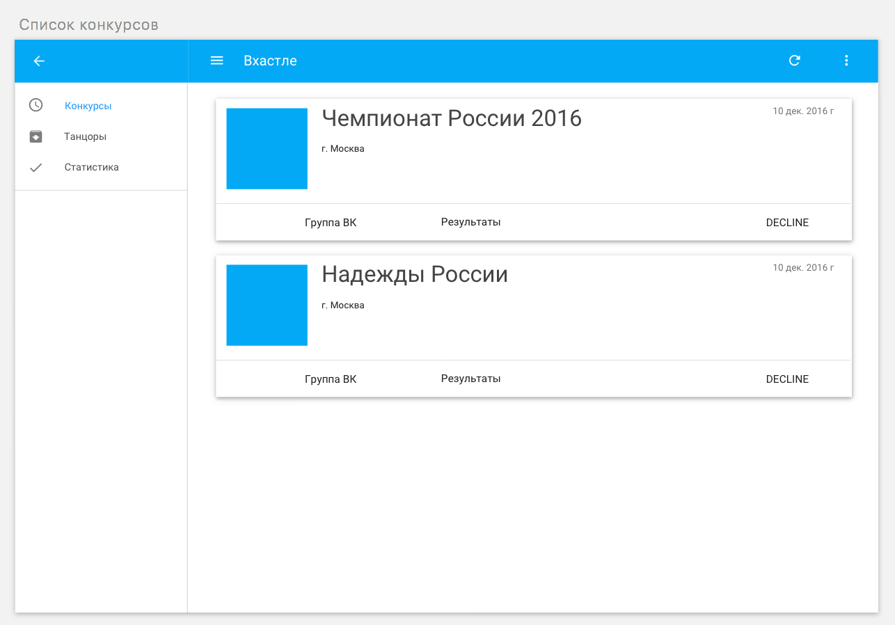
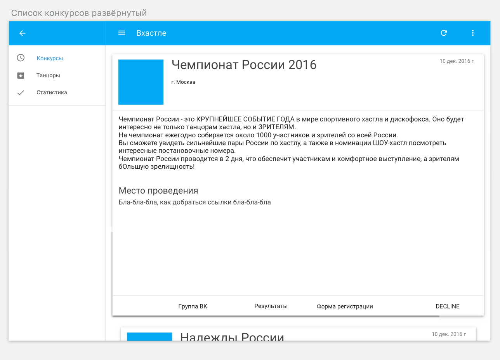
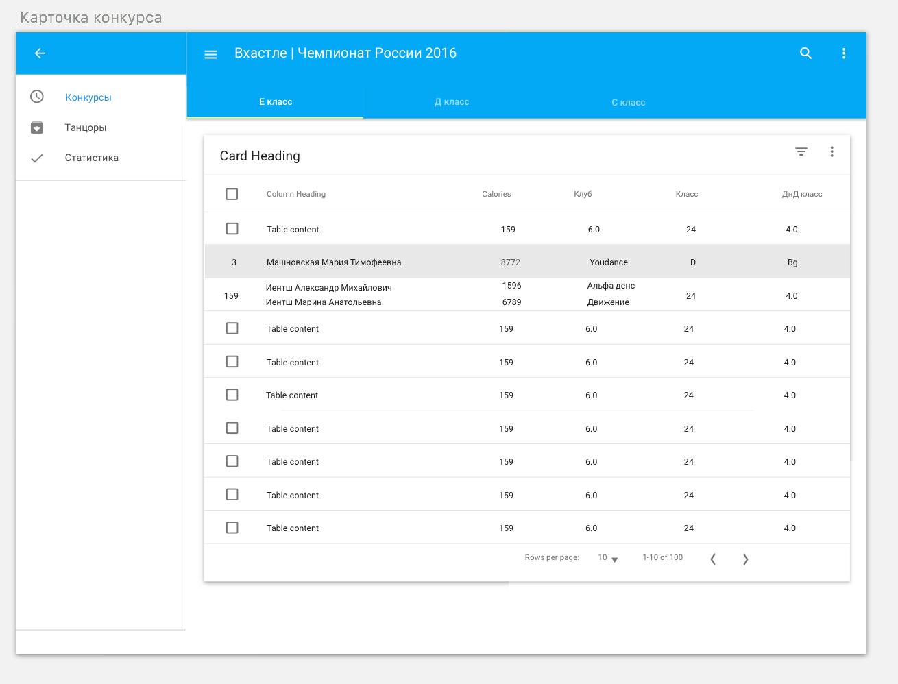

# Фича1

1) Список соревнований (Название, дата, город, аватарка). Список или плитка Card. По-умолчанию список актуальных соревнований. Фильтр по годам (возможно сезонам), городам.

2) На карточке соревнования (возможно показывать в раскрывайке):
* Организатор(текст)
* дата(текст, мб несколько дней)
* ссылка на форум (возможно иконка)
* ссылка на группу вк (наверное тоже иконкой)
* Место проведения (текст, в будущем ссылка на место проведения с картой)
* инфа по стоимости участия (текст)

Перед соревнованием важно знать список пререгистраций.
За день до соревнования вывешивают тайминг мероприятия. Хорошо бы уведомлялку запилить

После соревнования нужна инфа:
* Ссылка на результаты (текст формата: А-В классы: ссылка, JnJ RS, Main: ссылка). Возможно иконка кубка со всплывайкой
* Ссылкана видео (текст формата: первое отделение: ссылка, второй день: ссылка). Возможно иконка Ютуба с всплывайкой
* Ссылка на фотоальбомы

Примерный формат вывода результатов

